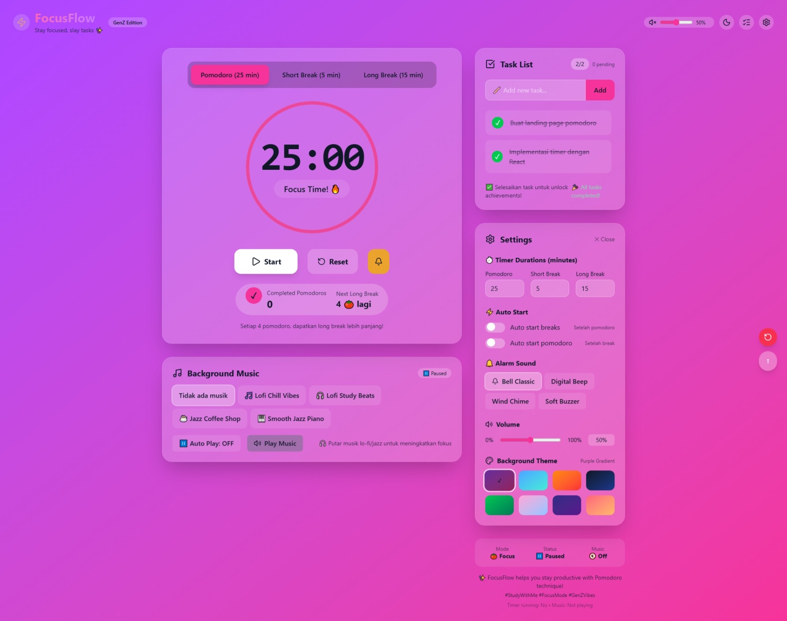

# FocusFlow ⏱️

A clean and minimal Pomodoro Timer designed to help you stay focused and productive — one session at a time.

🌐 Live Demo: https://pomodoro-focusflow.vercel.app

---

## ✨ Features
- Pomodoro, Short Break, and Long Break modes
- Auto cycle between focus and break sessions
- Task list to track what you’re working on
- Clean and modern dark UI
- Responsive layout (desktop & mobile)

---

## 🛠 Tech Stack
- React
- Vite
- Tailwind CSS
- Vercel (Deployment)

---

## 🧠 Why I Built This
I built FocusFlow to practice building a real-world React application with:
- clear state management
- clean component structure
- user-focused UI/UX decisions

This project is part of my journey to become a solid Front-End Developer.

---

## 📸 Preview


---

## 🚀 Getting Started (Local)
```bash
git clone https://github.com/syfarizal/pomodoro-focusflow.git
cd pomodoro-focusflow
npm install
npm run dev
```